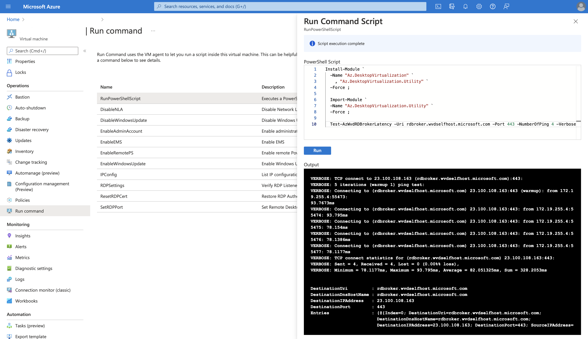
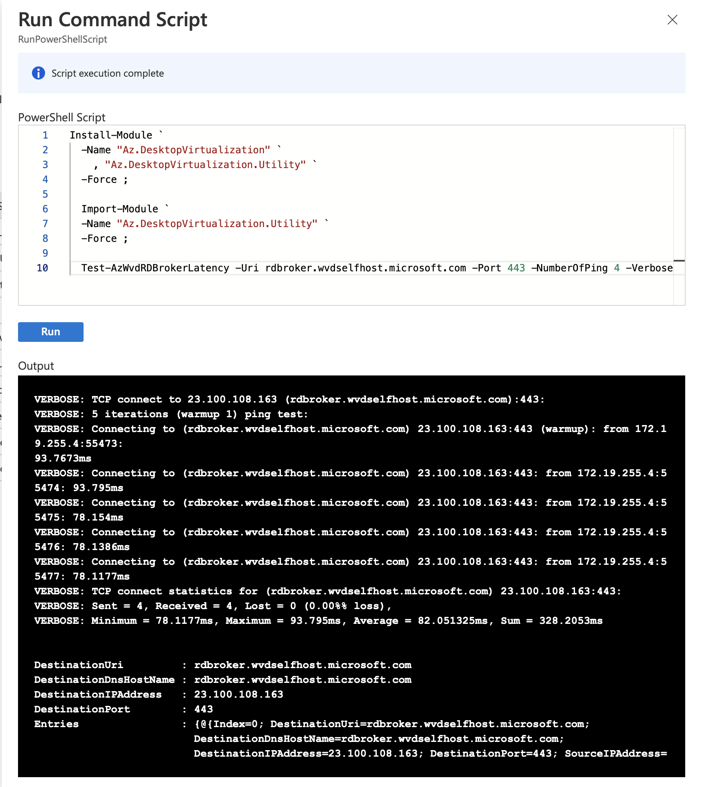

## Background

I have been spending weeks experimenting Azure Virtual Desktop with a custom
image that incorporate with a VPN solution on the Windows 10 session host.
After deployment, I experience remote desktop protocol (RDP) networking issue
since the Windows 10 session host will establish a virtual private network
(VPN) tunnel to special resources hosted some where else. My session host also
didn't manage to report to the host pool and I will need to troubleshooting the
Windows 10 session host networking.

I came across to this documentation about
[Error: Azure Virtual Desktop agent isn't reporting a heartbeat when running Get-AzWvdSessionHost](https://docs.microsoft.com/en-us/azure/virtual-desktop/troubleshoot-vm-configuration#error-azure-virtual-desktop-agent-isnt-reporting-a-heartbeat-when-running-get-azwvdsessionhost)
and I begun to wonder how should I try this out on the session host when I
cannot even establish a remote desktop connection into the host to manually
download SysInternal suite and execute the `psping` command.

<hr style='margin-top: 0.5em; margin-bottom: 0em; border-top: 1px solid #eaeaea'>
<p style='font-size: 16px; vertical-align: top; text-align: right;'>↑<a href='#top'>Top</a></p>

<!-- kiazhi.github.io - In-Article - Text & Image Advertisement -->
<ins class="adsbygoogle"
     style="display:block; text-align:center;"
     data-ad-layout="in-article"
     data-ad-format="fluid"
     data-ad-client="ca-pub-8419393181202253"
     data-ad-slot="9347590764"></ins>
<script>
     (adsbygoogle = window.adsbygoogle || []).push({});
</script>

<hr style='margin-top: 0.5em; margin-bottom: 0em; border-top: 1px solid #eaeaea'>

## Problem

How to validate if Azure Virtual Desktop agent is able to report heartbeat when
I cannot establish remote desktop connection into the host?

<hr style='margin-top: 0.5em; margin-bottom: 0em; border-top: 1px solid #eaeaea'>
<p style='font-size: 16px; vertical-align: top; text-align: right;'>↑<a href='#top'>Top</a></p>

<!-- kiazhi.github.io - In-Article - Text & Image Advertisement -->
<ins class="adsbygoogle"
     style="display:block; text-align:center;"
     data-ad-layout="in-article"
     data-ad-format="fluid"
     data-ad-client="ca-pub-8419393181202253"
     data-ad-slot="9347590764"></ins>
<script>
     (adsbygoogle = window.adsbygoogle || []).push({});
</script>

<hr style='margin-top: 0.5em; margin-bottom: 0em; border-top: 1px solid #eaeaea'>

## Solution

My solution ended up becoming a multiple weeks journey into developing an
`Az.DesktopVirtualization.Utility` PowerShell module to complement the
operation needs for troubleshooting with command line and use the `Run Command` capability from Azure Portal.



<hr style='margin-top: 0.5em; margin-bottom: 0em; border-top: 1px solid #eaeaea'>
<p style='font-size: 16px; vertical-align: top; text-align: right;'>↑<a href='#top'>Top</a></p>

<!-- kiazhi.github.io - In-Article - Text & Image Advertisement -->
<ins class="adsbygoogle"
     style="display:block; text-align:center;"
     data-ad-layout="in-article"
     data-ad-format="fluid"
     data-ad-client="ca-pub-8419393181202253"
     data-ad-slot="9347590764"></ins>
<script>
     (adsbygoogle = window.adsbygoogle || []).push({});
</script>

<hr style='margin-top: 0.5em; margin-bottom: 0em; border-top: 1px solid #eaeaea'>

### Installing the module

In this example, the statement below will install the
`Az.DesktopVirtualization.Utility` PowerShell module and its dependencies
PowerShell module.

```powershell
Install-Module `
  -Name "Az.DesktopVirtualization" `
    , "Az.DesktopVirtualization.Utility" `
  -Force
```

<hr style='margin-top: 0.5em; margin-bottom: 0em; border-top: 1px solid #eaeaea'>
<p style='font-size: 16px; vertical-align: top; text-align: right;'>↑<a href='#top'>Top</a></p>

<!-- kiazhi.github.io - In-Article - Text & Image Advertisement -->
<ins class="adsbygoogle"
     style="display:block; text-align:center;"
     data-ad-layout="in-article"
     data-ad-format="fluid"
     data-ad-client="ca-pub-8419393181202253"
     data-ad-slot="9347590764"></ins>
<script>
     (adsbygoogle = window.adsbygoogle || []).push({});
</script>

<hr style='margin-top: 0.5em; margin-bottom: 0em; border-top: 1px solid #eaeaea'>

### Importing the module

In this example, the statement below will import the installed
`Az.DesktopVirtualization.Utility` PowerShell module for use.

```powershell
Import-Module `
  -Name "Az.DesktopVirtualization.Utility" `
  -Force
```

<hr style='margin-top: 0.5em; margin-bottom: 0em; border-top: 1px solid #eaeaea'>
<p style='font-size: 16px; vertical-align: top; text-align: right;'>↑<a href='#top'>Top</a></p>

<!-- kiazhi.github.io - In-Article - Text & Image Advertisement -->
<ins class="adsbygoogle"
     style="display:block; text-align:center;"
     data-ad-layout="in-article"
     data-ad-format="fluid"
     data-ad-client="ca-pub-8419393181202253"
     data-ad-slot="9347590764"></ins>
<script>
     (adsbygoogle = window.adsbygoogle || []).push({});
</script>

<hr style='margin-top: 0.5em; margin-bottom: 0em; border-top: 1px solid #eaeaea'>

### Run the cmdlet

In this example, the statement below will perform a TCP network connectivity
test to `rdbroker.wvdselfhost.microsoft.com`.

```powershell
Test-AzWvdRDBrokerLatency `
  -Uri rdbroker.wvdselfhost.microsoft.com `
  -Port 443 `
  -NumberOfPing 4 `
  -Verbose
```

With the `-Verbose` parameter, it will displays the output similar to `psping`
and returns a `PSObject` on completion.

```output
VERBOSE: TCP connect to 23.100.108.163 (rdbroker.wvdselfhost.microsoft.com):443:
VERBOSE: 5 iterations (warmup 1) ping test:
VERBOSE: Connecting to (rdbroker.wvdselfhost.microsoft.com) 23.100.108.163:443 (warmup): from 172.19.255.4:55325: 78.1412ms
VERBOSE: Connecting to (rdbroker.wvdselfhost.microsoft.com) 23.100.108.163:443: from 172.19.255.4:55327: 78.1908ms
VERBOSE: Connecting to (rdbroker.wvdselfhost.microsoft.com) 23.100.108.163:443: from 172.19.255.4:55328: 78.1164ms
VERBOSE: Connecting to (rdbroker.wvdselfhost.microsoft.com) 23.100.108.163:443: from 172.19.255.4:55329: 78.1043ms
VERBOSE: Connecting to (rdbroker.wvdselfhost.microsoft.com) 23.100.108.163:443: from 172.19.255.4:55330: 78.1184ms
VERBOSE: TCP connect statistics for (rdbroker.wvdselfhost.microsoft.com) 23.100.108.163:443:
VERBOSE: Sent = 4, Received = 4, Lost = 0 (0.00%% loss),
VERBOSE: Minimum = 78.1043ms, Maximum = 78.1908ms, Average = 78.132475ms, Sum = 312.5299ms


DestinationUri         : rdbroker.wvdselfhost.microsoft.com
DestinationDnsHostName : rdbroker.wvdselfhost.microsoft.com
DestinationIPAddress   : 23.100.108.163
DestinationPort        : 443
Entries                : {@{Index=0; DestinationUri=rdbroker.wvdselfhost.microsoft.com;
                         DestinationDnsHostName=rdbroker.wvdselfhost.microsoft.com;
                         DestinationIPAddress=23.100.108.163; DestinationPort=443; SourceIPAddress=172.19.255.4;
                         SourcePort=55327; Status=Reachable; Latency(ms)=78.1908}, @{Index=1;
                         DestinationUri=rdbroker.wvdselfhost.microsoft.com;
                         DestinationDnsHostName=rdbroker.wvdselfhost.microsoft.com;
                         DestinationIPAddress=23.100.108.163; DestinationPort=443; SourceIPAddress=172.19.255.4;
                         SourcePort=55328; Status=Reachable; Latency(ms)=78.1164}, @{Index=2;
                         DestinationUri=rdbroker.wvdselfhost.microsoft.com;
                         DestinationDnsHostName=rdbroker.wvdselfhost.microsoft.com;
                         DestinationIPAddress=23.100.108.163; DestinationPort=443; SourceIPAddress=172.19.255.4;
                         SourcePort=55329; Status=Reachable; Latency(ms)=78.1043}, @{Index=3;
                         DestinationUri=rdbroker.wvdselfhost.microsoft.com;
                         DestinationDnsHostName=rdbroker.wvdselfhost.microsoft.com;
                         DestinationIPAddress=23.100.108.163; DestinationPort=443; SourceIPAddress=172.19.255.4;
                         SourcePort=55330; Status=Reachable; Latency(ms)=78.1184}}
Sent                   : 4
Received               : 4
Lost                   : 0
LossPercentage%        : 0.00%
MinimumLatency(ms)     : 78.1043
MaximumLatency(ms)     : 78.1908
AverageLatency(ms)     : 78.132475
SumLatency(ms)         : 312.5299
```

<hr style='margin-top: 0.5em; margin-bottom: 0em; border-top: 1px solid #eaeaea'>
<p style='font-size: 16px; vertical-align: top; text-align: right;'>↑<a href='#top'>Top</a></p>

<!-- kiazhi.github.io - In-Article - Text & Image Advertisement -->
<ins class="adsbygoogle"
     style="display:block; text-align:center;"
     data-ad-layout="in-article"
     data-ad-format="fluid"
     data-ad-client="ca-pub-8419393181202253"
     data-ad-slot="9347590764"></ins>
<script>
     (adsbygoogle = window.adsbygoogle || []).push({});
</script>

<hr style='margin-top: 0.5em; margin-bottom: 0em; border-top: 1px solid #eaeaea'>

## Conclusion

With this `Test-AzWvdRDBrokerLatency` cmdlet from the
`Az.DesktopVirtualization.Utility` PowerShell module, it can be an alternative
tool that is similar to executing `psping` command documented in
[Error: Azure Virtual Desktop agent isn't reporting a heartbeat when running Get-AzWvdSessionHost](https://docs.microsoft.com/en-us/azure/virtual-desktop/troubleshoot-vm-configuration#error-azure-virtual-desktop-agent-isnt-reporting-a-heartbeat-when-running-get-azwvdsessionhost)
documentation without the need to manually download and extract `psping` from
the SysInternal suite for execution.



What other benefits does this provide? It allows an operations team to execute
this command remotely to assess the latency while the current user is working
on his/her Personal Desktop session host and this cmdlet can also be used with
`Invoke-AzVMRunCommand` or `az vm run-command invoke` commands.

<hr style='margin-top: 0.5em; margin-bottom: 0em; border-top: 1px solid #eaeaea'>
<p style='font-size: 16px; vertical-align: top; text-align: right;'>↑<a href='#top'>Top</a></p>

<!-- kiazhi.github.io - In-Article - Text & Image Advertisement -->
<ins class="adsbygoogle"
     style="display:block; text-align:center;"
     data-ad-layout="in-article"
     data-ad-format="fluid"
     data-ad-client="ca-pub-8419393181202253"
     data-ad-slot="9347590764"></ins>
<script>
     (adsbygoogle = window.adsbygoogle || []).push({});
</script>

<hr style='margin-top: 0.5em; margin-bottom: 0em; border-top: 1px solid #eaeaea'>

## References

- [Error: Azure Virtual Desktop agent isn't reporting a heartbeat when running Get-AzWvdSessionHost](https://docs.microsoft.com/en-us/azure/virtual-desktop/troubleshoot-vm-configuration#error-azure-virtual-desktop-agent-isnt-reporting-a-heartbeat-when-running-get-azwvdsessionhost)
- [PowerShell Gallery: Az.DesktopVirtualization.Utility](https://www.powershellgallery.com/packages/Az.DesktopVirtualization.Utility/)
- [Github: Az.DesktopVirtualization.Utility](https://github.com/kiazhi/Az.DesktopVirtualization.Utility/)

<hr style='margin-top: 0.5em; margin-bottom: 0em; border-top: 1px solid #eaeaea'>
<p style='font-size: 16px; vertical-align: top; text-align: right;'>↑<a href='#top'>Top</a></p>

<!-- kiazhi.github.io - In-Article - Text & Image Advertisement -->
<ins class="adsbygoogle"
     style="display:block; text-align:center;"
     data-ad-layout="in-article"
     data-ad-format="fluid"
     data-ad-client="ca-pub-8419393181202253"
     data-ad-slot="9347590764"></ins>
<script>
     (adsbygoogle = window.adsbygoogle || []).push({});
</script>

<hr style='margin-top: 0.5em; margin-bottom: 0em; border-top: 1px solid #eaeaea'>

## Related Books

<div id="amzn-assoc-ad-f3a340a5-ce4d-4b4c-b409-c4c202ba7ffe"></div><script async src="//z-na.amazon-adsystem.com/widgets/onejs?MarketPlace=US&adInstanceId=f3a340a5-ce4d-4b4c-b409-c4c202ba7ffe"></script>

<hr style='margin-top: 0.5em; margin-bottom: 0em; border-top: 1px solid #eaeaea'>
<p style='font-size: 16px; vertical-align: top; text-align: right;'>↑<a href='#top'>Top</a></p>

<!-- kiazhi.github.io - In-Article - Text & Image Advertisement -->
<ins class="adsbygoogle"
     style="display:block; text-align:center;"
     data-ad-layout="in-article"
     data-ad-format="fluid"
     data-ad-client="ca-pub-8419393181202253"
     data-ad-slot="9347590764"></ins>
<script>
     (adsbygoogle = window.adsbygoogle || []).push({});
</script>

<hr style='margin-top: 0.5em; margin-bottom: 0em; border-top: 1px solid #eaeaea'>